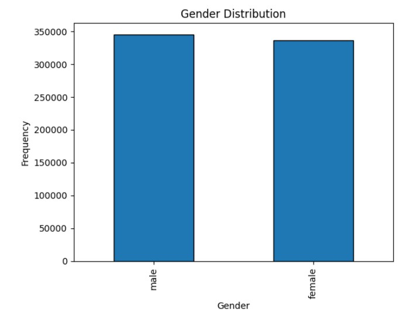
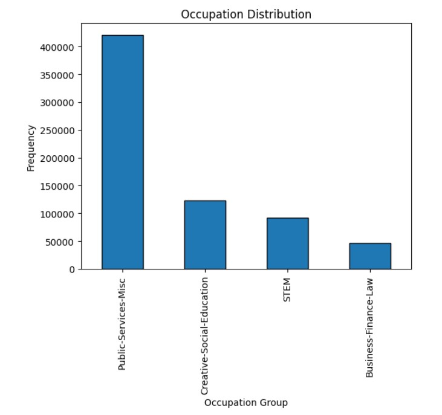
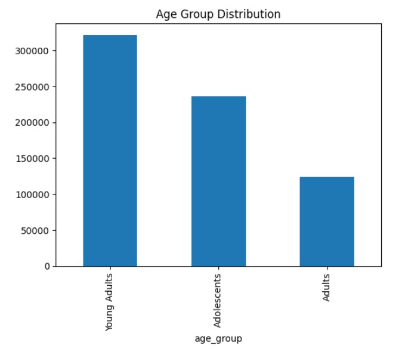
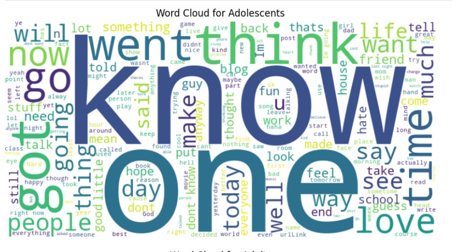
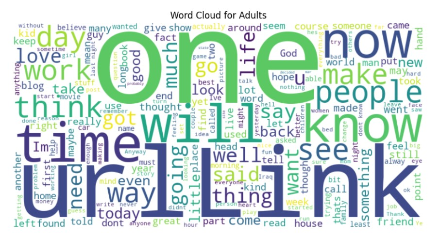

# **Author age group predictions based on the blogs written, gender, and occupation**

The project aims to model the author's age group based on the writing content, gender, and occupation. This is still an active area of research in Natural Language Understanding. 
We've also done a comparative analysis of static (GloVe 200) vs contextual embeddings (DistilBERT), to see its effect on the model performance (either classical ML models or Fully Connected Neural Networks).
The pipeline involves text preprocessing, feature integration, and model training with early stopping for efficient and robust classification.

---

## **Table of Contents**
- [Dataset](#dataset)
- [Approach](#approach)
- [Model Architecture](#model-architecture)
- [Results](#results)
- [Installation and Usage](#installation-and-usage)
- [Future Work](#future-work)
- [Acknowledgments](#acknowledgments)

---

## **Dataset**
https://www.kaggle.com/datasets/rtatman/blog-authorship-corpus

The Blog Authorship Corpus consists of the collected posts of 19,320 bloggers gathered from blogger.com in August 2004. The corpus incorporates a total of 681,288 posts and over 140 million words - or approximately 35 posts and 7250 words per person.

- **Features Used**:
  - Cleaned text data.
  - Gender (binary encoded). 


  - Occupation (target-encoded).


- **Target**:
  - Multi-class age group classification:
    - Adolescents (13–17)
    - Young Adults (18–30)
    - Adults (31+)


---

## **Approach**
1. **Text Preprocessing**:
   - Removed noise like URLs, HTML tags, and special characters.

2. **Exploratory Data Analysis**






4. **Embedding Generation**:
   - Used **DistilBERT** to generate 768-dimensional sentence embeddings.

5. **Feature Integration**:
   - Combined contextual embeddings with encoded categorical features (gender and occupation).

6. **Model Training**:
   - Built a Fully Connected Neural Network (FCNN) with early stopping.
   - Used **CrossEntropyLoss** for multi-class classification.

---

## **Model Architecture**
- **Input Features**: 
  - 770 dimensions (768 from DistilBERT + 2 categorical features).  
- **Hidden Layers**:
  - Four fully connected layers with ReLU activations and dropout regularization.  
- **Output Layer**:
  - Fully connected layer for logits corresponding to age group classes.

---

## **Results**
- **Accuracy**: Achieved a test accuracy of **62.59%**, outperforming the random baseline of 33.33%.  
- **Key Insights**:
  - DistilBERT embeddings significantly improved performance.
  - Including gender and occupation enhanced model predictions.  

---

## **Installation and Usage**
### **Prerequisites**
- Python 3.8+
- PyTorch
- Hugging Face Transformers
- Scikit-learn
- tqdm

### **Steps to Run**:
1. Clone this repository:
   ```bash
   git clone https://github.com/yourusername/age-group-prediction.git
   cd age-group-prediction
   ```
2. Install required dependencies:
   ```bash
   pip install -r requirements.txt
   ```
3. Prepare the dataset and update paths in the script.
4. Run the training pipeline:
   ```bash
   python train.py
   ```

---

## **Future Work**
- **Fine-tuning DistilBERT** to explore its full potential.
- Incorporating additional features like sentiment analysis or topic modeling.
- Experimenting with transformer-based architectures for further improvements.

---

## **Acknowledgments**
- Hugging Face for providing pre-trained models and tokenizers.
- PyTorch for its flexible and powerful deep learning framework.

