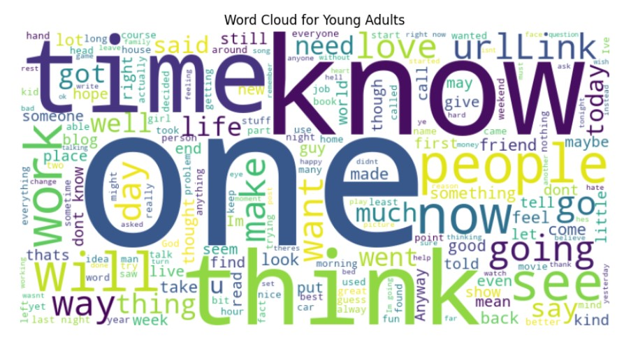

# **Author age group predictions based on the blogs written, gender, and occupation**

The project aims to model the author's age group based on the writing content, gender, and occupation. This is still an active area of research in Natural Language Understanding. 
We've also done a comparative analysis of static (GloVe 200) vs contextual embeddings (DistilBERT), to see its effect on the model performance (either classical ML models or Fully Connected Neural Networks).
The pipeline involves text preprocessing, feature integration, and model training with early stopping for efficient and robust classification.
**The entire code is a PyTorch modular implementation. Also, for enabling accelerated training, the modeling was done on the NVIDIA GeForce RTX 2060 employing CUDA toolkit. **
---

## **Table of Contents**
- [Dataset](#dataset)
- [Approach](#approach)
- [Model Architecture](#model-architecture)
- [Results](#results)
- [Installation and Usage](#installation-and-usage)
- [Future Work](#future-work)
- [Acknowledgments](#acknowledgments)

---

## **Dataset**
https://www.kaggle.com/datasets/rtatman/blog-authorship-corpus

The Blog Authorship Corpus consists of the collected posts of 19,320 bloggers gathered from blogger.com in August 2004. The corpus incorporates a total of 681,288 posts and over 140 million words - or approximately 35 posts and 7250 words per person.

- **Features Used**:
  - Cleaned text data.
  - Gender (binary encoded). 


  - Occupation (target-encoded).


- **Target**:
  - Multi-class age group classification:
    - Adolescents (13–17)
    - Young Adults (18–30)
    - Adults (31+)


---

## **Approach**
1. **Text Preprocessing**:
   - Removed noise like URLs, HTML tags, and special characters.

2. **Exploratory Data Analysis**





3. **Embedding Generation**:
   We explored two methods for generating embeddings to represent the text data effectively:

    1. Static Embeddings using GloVe (200-Dimensional)
      GloVe (Global Vectors for Word Representation) generates a 200-dimensional vector representation for every word in the vocabulary. These embeddings are then combined with encoded features for gender and occupation to enhance the representation.
      Advantage: GloVe provides a simple yet effective way to represent words based on their co-occurrence statistics.
      Limitation: Static embeddings like GloVe do not capture context effectively, as the representation of a word remains the same regardless of its usage in different contexts.
    2. Contextual Embeddings using DistilBERT
      DistilBERT, a lightweight version of BERT, generates contextual embeddings where the vector representation of a word depends on its surrounding context in the sentence. This helps capture nuanced meanings and relationships in the text.
      Advantage: Contextual embeddings offer a deeper understanding of word meanings based on their context, making them highly effective for tasks like author profiling.
      Limitation: Requires more computational resources compared to static embeddings like GloVe.

    By leveraging these two approaches, we compared their performance in profiling authors and observed the trade-offs between simplicity and contextual understanding in embeddings.

4. **Model Training**:
   Classical Machine Learning models were used alongside Deep Learning Architectures for a more comprehensive understanding. Although, the below model yielded the best results:
   - Built a Fully Connected Neural Network (FCNN) with early stopping.
   - Used **CrossEntropyLoss** for multi-class classification.

    **The entire code is a PyTorch modular implementation. Also, for enabling accelerated training, the modeling was done on the NVIDIA GeForce RTX 2060 employing CUDA toolkit. **
---

## **Model Architecture**
- **Input Features**: 
  - 770 dimensions (768 from DistilBERT + 2 categorical features).  
- **Hidden Layers**:
  - Four fully connected layers with ReLU activations and dropout regularization.  
- **Output Layer**:
  - Fully connected layer for logits corresponding to age group classes.

---

## **Results**
- **Accuracy**: Achieved a test accuracy of **62.59%**, outperforming the random baseline of 33.33%.  
- **Key Insights**:
  - DistilBERT embeddings significantly improved performance.
  - Including gender and occupation enhanced model predictions.  

---

## **Installation and Usage**
### **Prerequisites**
- Python 3.8+
- PyTorch
- Hugging Face Transformers
- Scikit-learn
- tqdm

### **Steps to Run**:
1. Clone this repository:
   ```bash
   git clone https://github.com/yourusername/age-group-prediction.git
   cd age-group-prediction
   ```
2. Install required dependencies:
   ```bash
   pip install -r requirements.txt
   ```
3. Prepare the dataset and update paths in the script.
4. Run the training pipeline:
   ```bash
   python train.py
   ```

---

## **Future Work**
- **Fine-tuning DistilBERT** to explore its full potential.
- Incorporating additional features like sentiment analysis or topic modeling.
- Experimenting with transformer-based architectures for further improvements.

---

## **Acknowledgments**
- Hugging Face for providing pre-trained models and tokenizers.
- PyTorch for its flexible and powerful deep learning framework.

